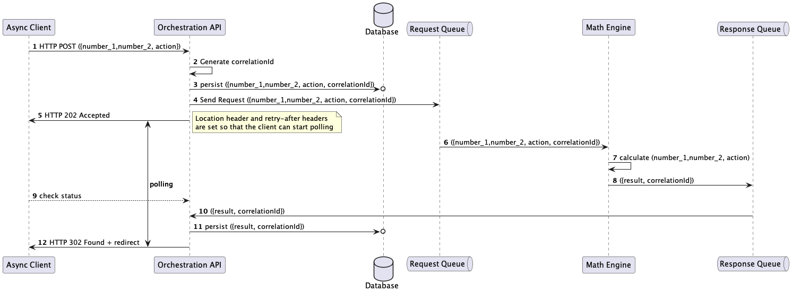

# Async Request Reply Pattern
The Async Request Reply pattern makes use of two message brokers. 
One for the request for a microservice down the line and one for the reply of that workload.

The implementation in comparison to a synchronous but unsafe daisy-chained REST calls, is a bit more complex.

See the following diagram describing the components

and the flow

